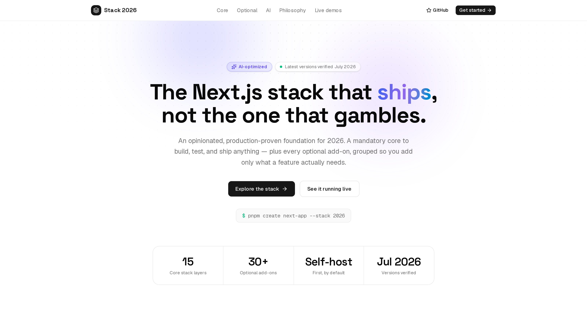
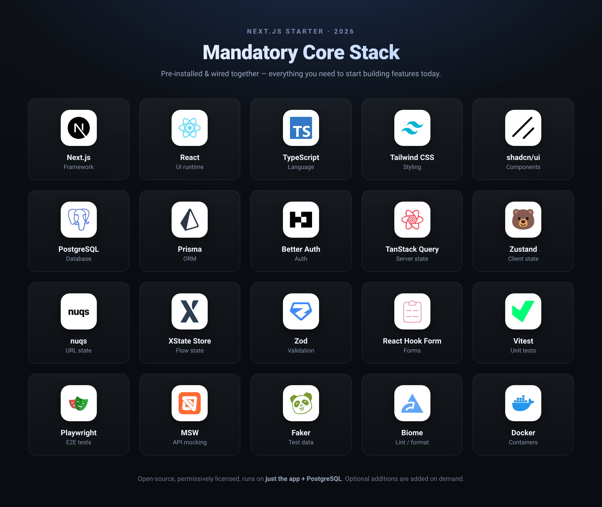

# next-js-stack-starter-2026

[](./LICENSE)
[](https://github.com/maher-naija-pro/next-js-stack-starter-2026/actions/workflows/ci.yml)
[](https://nextjs.org)
[](https://github.com/maher-naija-pro/next-js-stack-starter-2026)

> **The Next.js starter built for AI coding agents — type "Add Stripe" in Claude Code and it's installed, wired, and verified.**

<!-- TODO: replace with a <30s GIF of `Add Stripe to this project` running end-to-end in Claude Code (record → convert → drop in ./docs/demo.gif) -->
<a href="https://next-js-stack-starter-2026.vercel.app/">
  
</a>

## Why this exists

Every tool was chosen against the same five filters, in priority order:

1. **Compatible with the latest Next.js & its ecosystem** — App Router, React Server Components, Server Actions. No legacy choices bolted on.
2. **Open source & permissively licensed** — MIT / Apache-2.0 / BSD only. No BSL, SSPL, or "open-core with a paywall" traps.
3. **Fewer extra dependencies** — reuse what's already in the stack over adding new moving parts (Postgres does jobs *and* search, not Redis/Elastic).
4. **No external services** where avoidable — the minimal production footprint is just **the Next.js app + PostgreSQL**.
5. **No mandatory SaaS / hosted APIs** — nothing forces a monthly bill except the two truly unavoidable ones: **Stripe** and email delivery (swappable for self-hosted SMTP).

On top of that, this starter is built to be built *with* AI, and to ship AI features:

- **Agent-friendly codebase.** Strict TypeScript, Zod schemas, and generated Prisma types give AI coding agents (like Claude Code) a tight, type-checked feedback loop. Biome lints in milliseconds and conventions stay consistent, so generated code fits the existing patterns instead of fighting them.
- **Extensible by asking.** The `add-stack-component` Claude Code skill installs and wires optional pieces on demand, following the repo's own conventions — see [Adding optional components](#adding-optional-components).
- **AI features are first-class.** The **Vercel AI SDK** (streaming, tool calls, structured output) and **pgvector** for embeddings + hybrid RAG search are in the Optional Additions — build chat, semantic search, and agents on the Postgres you already run. ⚠️ AI features always need a model provider: a hosted API (Anthropic/OpenAI, billed per token) or a self-hosted Ollama.

## Stack

| Layer | Tools |
|---|---|
| Framework | Next.js (App Router, RSC), React, TypeScript (strict) |
| Styling / UI | Tailwind CSS, shadcn/ui |
| Database / ORM | PostgreSQL, Prisma |
| Auth | Better Auth |
| Data & state | TanStack Query, Zustand, nuqs, XState Store, Zod, React Hook Form |
| Testing | Vitest, Playwright, MSW, Faker |
| Tooling | Biome, Docker |



Every tool was deliberately chosen, not just defaulted to — see [STACK.md](./STACK.md) for the full list and the reasoning behind each pick.

**How it's organized:**

- ✅ **Mandatory Core Stack** — installed and working right now (see `pnpm dev` below).
- ➕ **Optional Additions** — payments, email, search, AI, charts, and 30+ more, documented in STACK.md but *not* installed. Add only what your project actually needs, on demand — see [Adding optional components](#adding-optional-components).

## Getting started

```bash
pnpm install

# Start local Postgres (18)
docker compose up -d postgres

cp .env.example .env   # adjust if you changed the Postgres port/credentials

pnpm db:migrate         # applies prisma/migrations
pnpm db:seed            # seeds a demo user

pnpm dev                # http://localhost:5002
```

Other useful scripts:

```bash
pnpm lint          # Biome check
pnpm lint:fix       # Biome check --write
pnpm test           # Vitest unit tests
pnpm test:e2e        # Playwright e2e tests (starts its own dev server)
pnpm build           # production build (Next.js standalone output)
pnpm db:studio        # Prisma Studio
```

To run the whole thing in Docker (app + Postgres):

```bash
docker compose up -d
```

### Production deployment

`docker-compose.yml` is dev-friendly by default (exposed DB port, fallback secrets). For a real deployment, layer `docker-compose.prod.yml` on top — it requires real secrets (fails loudly if unset), removes the DB's host port, adds resource limits, log rotation, and container hardening (read-only root FS, no-new-privileges):

```bash
export POSTGRES_PASSWORD=$(openssl rand -base64 24)
export BETTER_AUTH_SECRET=$(openssl rand -base64 32)
export BETTER_AUTH_URL=https://your-real-domain.com

docker compose -f docker-compose.yml -f docker-compose.prod.yml up -d --build
```

The app exposes `/api/health` (checked by the Dockerfile's `HEALTHCHECK` and useful for a load balancer/orchestrator) — it pings the DB, not just process liveness.

## Adding optional components

Everything in STACK.md's **Optional Additions** — Dev & Ops Tooling, Platform Services, UI & App Libraries — is added on demand via the `add-stack-component` Claude Code skill (`.claude/skills/add-stack-component/`), not pre-installed.

**Usage:** in Claude Code, just ask — e.g.:

```
Add Stripe and Recharts to this project
```
```
/add-stack-component
```

If you don't name specific components, it asks which category and which items interest you, then for each one:

1. Checks whether it's already installed (skips cleanly if so)
2. Installs the package(s) via `pnpm`, versioned to match STACK.md
3. Wires up minimal working integration code following this project's existing conventions — reusing `src/lib/prisma.ts` and `src/lib/auth.ts` rather than creating parallel clients, respecting the "zero-dependency default → heavier upgrade" pattern (e.g. it won't add a Redis-backed error tracker when the Postgres-only default covers it, unless you ask for the upgrade)
4. Flags before adding any **new Docker service** to `docker-compose.yml` — some optional components (GlitchTip, Umami, SeaweedFS) need one; most don't
5. Runs `pnpm lint`, a typecheck, and `pnpm build` to confirm nothing broke
6. Reports what was installed, what files changed, and any env vars you need to fill in with real values

The skill never substitutes a different tool than what STACK.md specifies — if it thinks something better exists now, it'll ask rather than silently swap it in. Per-component install/integration details live in `.claude/skills/add-stack-component/references/` (one file per category) if you want to read them yourself before asking.

See [STACK.md](./STACK.md) for the full list of 30+ optional integrations and the reasoning behind each pick.

**🔗 Live demo → [next-js-stack-starter-2026.vercel.app](https://next-js-stack-starter-2026.vercel.app/)**

